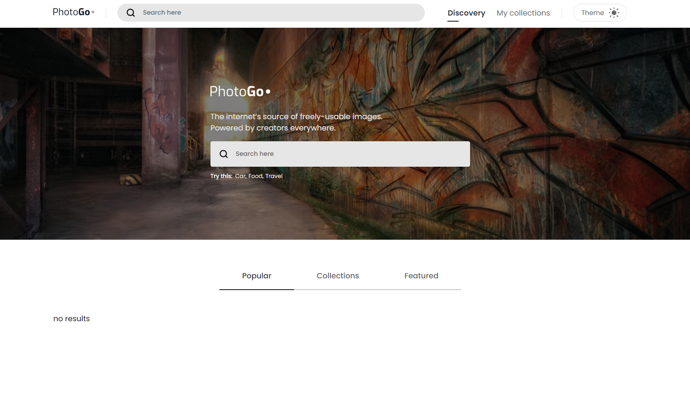

# um simples de buscador de fotos | PROJETO PARA ESTUDO

## Sobre o Projeto

Objetivo do projeto é realizar um sistema funcional com vários componentes e estados simulando aplicativos como Pexels e unsplash que são agregadores de fotos. O projeto não é fazer uma cópia mais simples porém com maiorias das funções reais.
